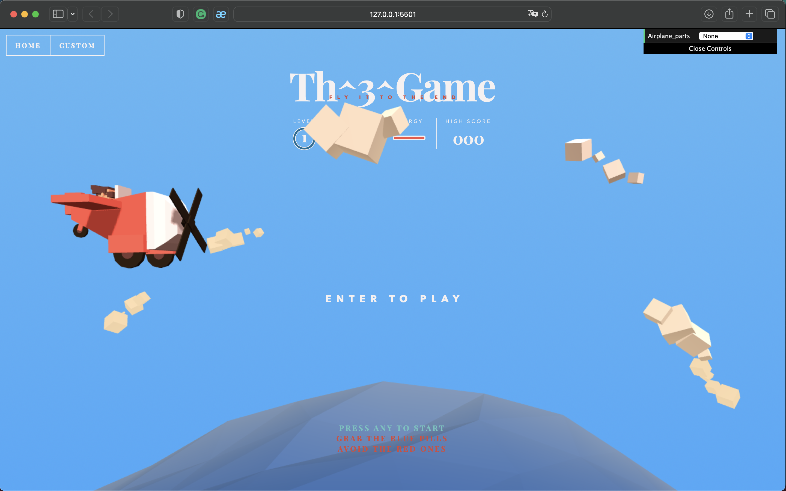
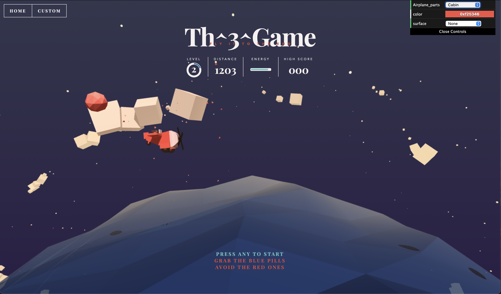

<h1 align = "center"> Computer Graphic Project</h1>

## Sơ lược đồ án

  </img>
  

  </img>

  </img>
  <ul>
    <li><b>Level:</b> Cấp độ/độ khó.</li>
    <li><b>Distance:</b> Khoảng cách mà máy bay đã đi</li>
    <li><bEnergy:</b> Năng lượng của máy bay</li>
    <li><b>High score:</b> Kỉ lục quãng đường xa nhất mà máy bay đã bay được</li>
  </ul>

      
## Thông tin sinh viên
<table >
  <tr>
    <th>Họ và tên sinh viên</th>
    <th>Mã số sinh viên</th>
    <th>Mail sinh viên</th>
  </tr>
  <tr>
    <td>Nguyễn Phan Quốc Thiện</td>
    <td>20520775</td>
    <td>20520775@gm.uit.edu.vn</td>
  </tr>
  <tr>
    <td>Nguyễn Cao Thắng</td>
    <td>20520758</td>
    <td>20520758@gm.uit.edu.vn</td>
  </tr>
  <tr>
    <td>Đỗ Đức Thịnh</td>
    <td>20520780</td>
    <td>20520780@gm.uit.edu.vn</td>
  </tr>
</table>
